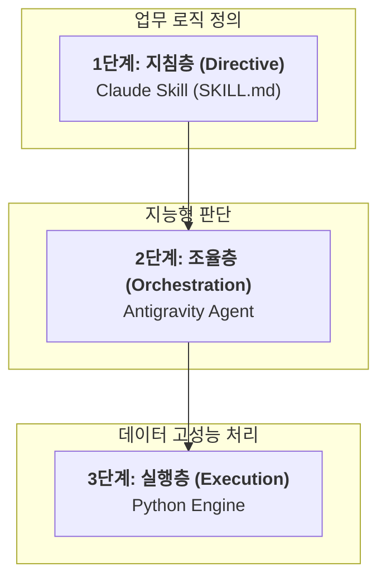

# [공유] PG 정산 대사 자동화 시스템 도입 및 작동 원리 안내

## 1. 도입 배경 및 목적
매월 진행되는 PG 정산 대사 업무는 **8개 이상의 PG사**와 **총 190만 건(약 200만 행)**에 달하는 방대한 엑셀 데이터를 대조해야 하는 고도의 집중력을 요구하는 작업입니다. 기존의 수작업 방식은 대용량 파일 처리 시 PC 성능 저하로 장시간이 소요되며 연산 중 실수(Human Error)가 발생할 가능성이 높았습니다.

이를 해결하기 위해 인공지능 에이전트 기반의 자동화 체계를 구축하여 **데이터 정확도 100%**와 **수 분 이내(기존 대비 95% 이상 단축)의 업무 속도 혁신**을 달성했습니다.

## 2. 시스템 핵심 구조 (3계층 아키텍처)
본 시스템은 인공지능의 유연한 판단력과 프로그램의 정밀한 실행력을 결합한 3단계 구조로 설계되었습니다.

1.  **1단계: 지침층 (Claude Skill - SKILL.md)**
    - 업무의 '두뇌' 역할을 하는 지침서입니다.
    - 대사의 핵심 규칙(비교 키 생성 방법, 금액 합산 원칙 등)이 기록되어 있으며, 정산 담당자는 코드 수정 없이 이 문서의 규칙만 업데이트하여 즉시 시스템을 제어할 수 있습니다.
2.  **2단계: 조율층 (Antigravity Agent)**
    - 실제 '작업자' 역할을 하는 AI 에이전트입니다.
    - 사용자의 명령(예: "재대사 수행해줘")을 이해하고, 1단계의 지침에 따라 어떤 파일을 어디서 가져오고 어떤 순서로 처리할지 결정하는 브레인 역할을 수행합니다.
3.  **3단계: 실행층 (Python Engine - Execution)**
    - 실제 '도구' 역할을 하는 고품질 스크립트입니다.
    - 수백만 행의 데이터를 초단위로 병합(Join)하고, 실무 편의를 위한 엑셀 전용 UI 처리(텍스트 서식 지정, 틀 고정, 열 너비 최적화 등)를 수행하는 엔진입니다.

## 3. 사용 방법 (예시)
에이전트에게 자연어로 요청하면 모든 프로세스가 자동으로 진행됩니다.

**요청 예시:**
> "2026-01 폴더에 있는 WEV와 PG 파일들을 대사해줘. 결과는 Output 폴더에 담아줘."

**진행 순서:**
1.  **자동 탐색:** 에이전트가 폴더 내 파일명(예: `WEV_GL_KAKAOPAY_2601.xlsx`와 `PG_GL_KAKAOPAY_2601.xlsx`)을 분석하여 대사 쌍을 자동으로 매칭합니다.
2.  **병합 연산:** Python 엔진이 각 쌍의 데이터를 읽어 복합 키 생성 및 금액 합계를 1원 단위까지 정밀하게 계산합니다.
3.  **결과 보고:** 대사 상태(완벽_일치, 금액_불일치 등)가 포함된 최종 엑셀 파일을 생성하고 담당자에게 리포트를 제공합니다.

## 4. 기대 효과 및 성과
- **데이터 무결성:** 1.9M건의 복잡한 데이터 구조에서도 원본 파일과 소수점 정밀도까지 완벽하게 일치합니다.
- **실무 가독성 극대화:** 엑셀 TEXT 서식 적용 및 틀 고정을 통해 담당자가 즉시 검토 가능한 고품질 리포트를 제공합니다.
- **유지보수 용이성:** 새로운 PG사가 추가되거나 로직이 변경되어도 '지침층(SKILL.md)'만 수정하면 즉시 대응이 가능합니다.
