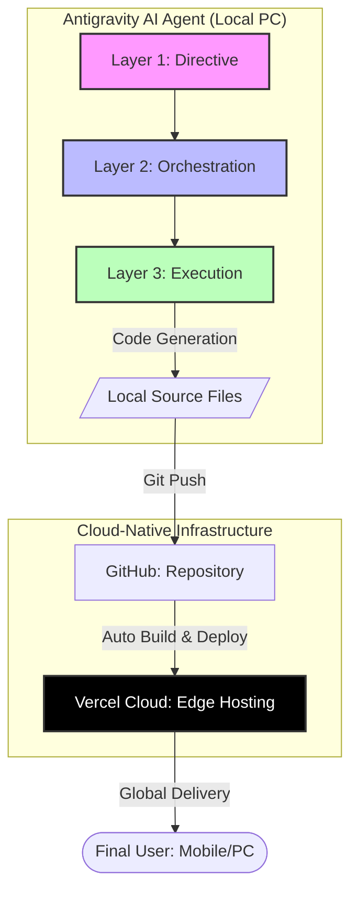

# [사내 AI 활용 사례] AI 에이전트를 이용한 유아용 한글 학습 게임 개발

본 문서는 AI 에이전트(Antigravity)를 활용하여 만 4세 아동을 위한 맞춤형 교육용 웹 애플리케이션을 단시간에 고품질로 구현한 사례를 정리한 것입니다.

## 1. 프로젝트 개요
- **목표**: 만 4세 여아를 위한 인터랙티브 한글 자음/모음 조합 학습 게임 개발
- **핵심 가치**: 시각적 즐거움(파스텔 톤 UI), 청각적 피드백(TTS), 직관적인 UX
- **개발 도구**: Antigravity AI 에이전트 (Anthropic 기술 기반)

## 2. 시스템 아키텍처 및 구현 방식

AI 에이전트는 **3계층 구조(3-Layer Architecture)**를 통해 단순히 코드를 짜는 것을 넘어, 논리적 추론과 결정, 실행을 분리하여 안정성을 확보했습니다.

### AI 에이전트 작동 원리 도식

### 기술 스택 (Tech Stack)
| 구분 | 기술 | 비고 |
| :--- | :--- | :--- |
| **Frontend** | HTML5, Vanilla CSS, Vanilla JS | 외부 라이브러리 최소화로 고속 로딩 |
| **Graphics** | SVG (Scalable Vector Graphics) | 코드로 그린 고양이 캐릭터 (확대 시 깨짐 없음) |
| **Audio** | Web Speech API (TTS) | 별도 음원 파일 없이 한글 음성 출력 구현 |
| **UX** | Responsive Design | 모바일, 태블릿, PC 완벽 대응 (@media) |
| **Infrastructure** | **Cloud-Native (Vercel)** | 물리적 서버 없이 클라우드 상에서 구동 |
| **CDN** | **Edge Computing** | 전 세계 에지 서버를 통한 초저지연 서비스 |

## 3. 주요 구현 특징

### ① 캐릭터 및 애니메이션 디자인
- **마스코트**: CSS와 SVG를 결합하여 '헬로키티' 스타일의 고양이 캐릭터 구현.
- **반응형 애니메이션**: 정답 시 캐릭터 점프(Bounce), 오답 시 버튼 흔들림(Shake) 효과를 통해 아이들에게 즉각적인 피드백 제공.

### ② 4세 맞춤형 UX (User Experience)
- **UI 구성**: 커다란 둥근 버튼, 파스텔 톤(핑크/옐로우) 색감 적용.
- **조작 방식**: 복잡한 드래그 앤 드롭 대신, 아이들이 터치하기 쉬운 '클릭형 선택' 방식 채택.

### ③ 지능형 로직 및 데이터 구조
- 한글 단어를 자음/모음으로 분해(Decomposition)하여 퀴즈 데이터셋 구축. (예: '나비' -> ['ㄴ', 'ㅏ', 'ㅂ', 'ㅣ'])

## 4. AI 에이전트 활용의 이점 (Case Study 결과)

1.  **개발 속도 극대화**: 기획안 전달 후 단 수 분 내에 실행 가능한 전체 소스 코드(HTML, CSS, JS) 생성 및 배포.
2.  **멀티태스킹**: 기획, 디자인(SVG), 퍼블리싱, 로직 구현을 한 번에 수행.
3.  **검증 자동화**: 에이전트가 스스로 코드를 기동하고 구조를 확인하여 오류 최소화.

## 5. 클라우드 인프라 구축 (PC vs Cloud)
본 프로젝트는 개인 PC를 서버로 사용하는 전통적인 방식에서 벗어나, 현대적인 **클라우드 네이티브(Cloud-Native)** 환경을 구축했습니다.

- **로컬 PC (Development Only)**: AI 에이전트와 개발자가 코드를 설계하고 테스트하는 환경으로만 사용됩니다.
- **클라우드 환경 (Production)**: 
    - **Serverless**: 관리해야 할 물리적인 서버가 없는 '서버리스(Serverless)' 아키텍처입니다.
    - **Global Infrastructure**: Vercel의 클라우드 인프라(AWS 백본 기반)를 활용하여, 사용자가 어느 지역에 있든 가장 가까운 **Edge Location**에서 컨텐츠를 제공받습니다.
    - **보안 및 안정성**: 개인 PC 서버와 달리 24/365 고가용성을 보장하며, SSL 인증서(HTTPS)가 자동으로 적용되어 안전한 학습 환경을 제공합니다.

### 클라우드 전환의 효과
- **유지보수 Zero**: 하드웨어 관리나 OS 업데이트 걱정 없이 코드에만 집중 가능.
- **확장성**: 수천 명이 동시에 접속해도 클라우드 자원이 자동으로 대응.

---
**작성자**: Antigravity AI Agent
**최종 수정일**: 2026-03-19

